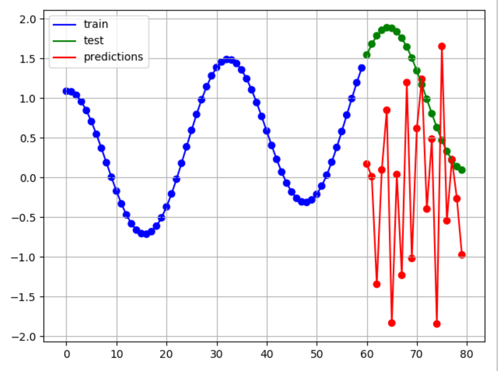
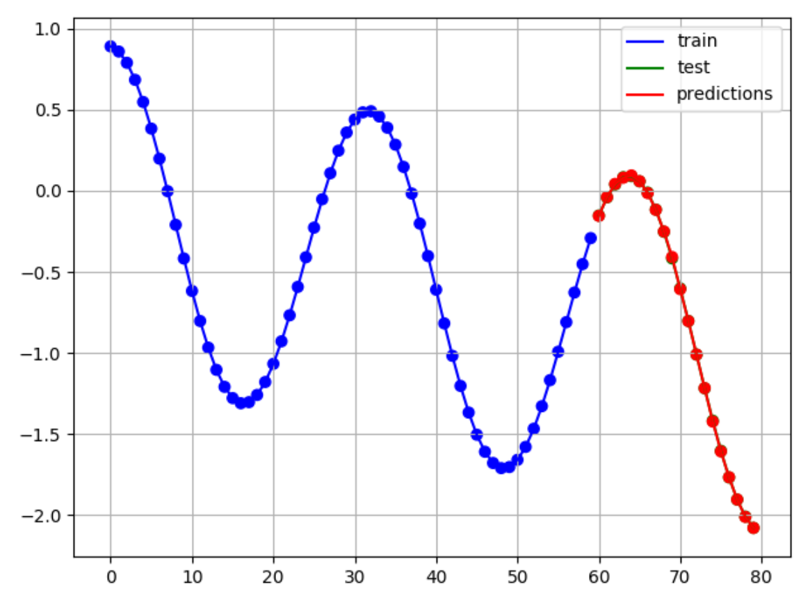

# N-BEATS
Neural basis expansion analysis for interpretable time series forecasting.

https://arxiv.org/abs/1905.10437

   
  <i>Predictions of a sine with random offset and slope (before training).</i>

   
  <i>Predictions of a sine with random offset and slope (while training).</i>

   
  <i>Predictions of a sine with random offset and slope (training finished).</i>

